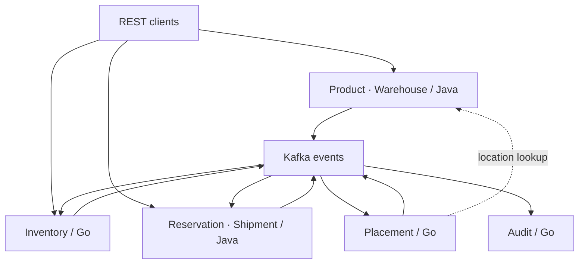
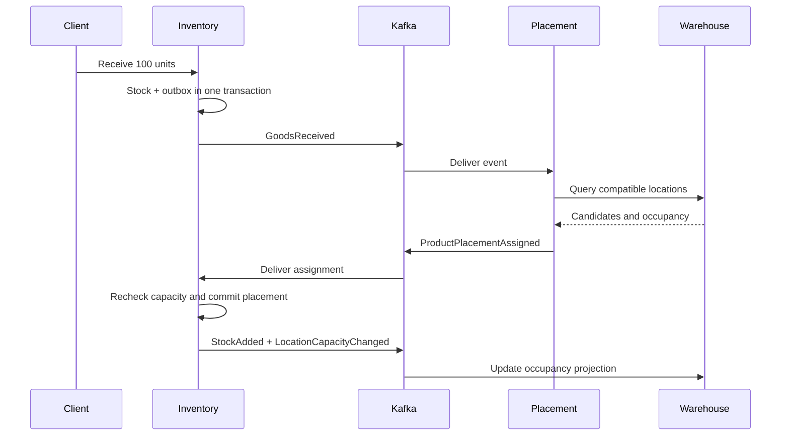

# LogiCore WMS

**An event-driven warehouse management backend built with Java 21 and Go.**

Seven independently deployable services cover receiving, automatic put-away, lot-level inventory, reservations, shipments and a searchable audit trail. The project focuses on correctness at service boundaries: concurrent stock changes, duplicate delivery, transactional event publication and asynchronous confirmation.

This is a local portfolio system, not a hosted SaaS. No frontend is included. See [verification evidence](docs/verification.md) for exactly what has and has not been executed.

## Features

- Warehouses → zones → racks → storage locations with weight and volume limits.
- Product catalogue with unique SKUs, immutable physical properties and soft deletion.
- Receipt lots, batch numbers and optional expiration dates; FEFO reservation allocation.
- Automatic location scoring and durable retries when no suitable capacity exists.
- Stock moves, write-offs and audited absolute quantity adjustments.
- Atomic multi-line reservations, cancellation and durable expiration.
- Shipment state machine; stock is deducted before `SHIPPED` is confirmed.
- Transactional outbox, consumer inbox, durable HTTP idempotency and dead-letter handling.
- PostgreSQL constraints and warehouse-scoped transaction locks protect stock/capacity.
- Structured logging, correlation IDs, OpenTelemetry traces, Prometheus and Grafana.

## Architecture



Each service owns a **separate PostgreSQL container and database**. No service queries another service's tables. Shared libraries contain infrastructure, not a shared domain database. [Detailed architecture](docs/architecture.md) · [Architecture decisions](docs/adr/)

## Tech stack

| Area | Technology |
|---|---|
| Catalogue and workflows | Java 21, Spring Boot 3.5, JPA/Hibernate, Bean Validation, MapStruct |
| Inventory and workers | Go 1.27.1, standard-library HTTP router, pgx, slog |
| Persistence | PostgreSQL 16, Flyway, golang-migrate |
| Messaging | Kafka 3.9 in KRaft mode; JSON event envelopes |
| Coordination | PostgreSQL transaction locks; Redis placement mutex |
| Observability | Micrometer, OpenTelemetry, Prometheus, Grafana, Jaeger |
| Delivery | Docker Compose, GitHub Actions |
| Tests | JUnit 5, Mockito, Testcontainers, Go testing, testify, black-box Python tests |

The standard Go HTTP router is used instead of Gin/Fiber; see [ADR-006](docs/adr/ADR-006-scope-and-tradeoffs.md). Dependency versions and checksums are committed in `pom.xml`, `go.mod` and `go.sum`.

## Services

| Service | Language | Host port | Responsibility |
|---|---|---:|---|
| warehouse-service | Java | 8081 | Warehouse layout and occupancy projection |
| product-service | Java | 8082 | Product catalogue |
| inventory-service | Go | 8083 | Authoritative stock, capacity ledger, allocations, reservation TTL |
| placement-service | Go | 8084 | Durable placement jobs and scoring |
| reservation-service | Java | 8085 | Reservation API and lifecycle projection |
| shipment-service | Java | 8086 | Shipment orchestration and confirmation |
| audit-service | Go | 8087 | Immutable event history |

## Getting started

Requirements: Docker Engine/Desktop with Compose v2, Python 3.10+, approximately **8 GB available RAM** and free disk space for seven databases and build images. Java, Go and Maven are only needed for development outside containers.

```bash
python3 scripts/init_env.py
docker compose up --build -d --wait --wait-timeout 600
python3 scripts/demo.py
```

Or run `make up` followed by `make smoke`. The environment initializer generates local passwords and preserves an existing `.env`. Nothing needs to be copied into source files.

Windows PowerShell: use `python` instead of `python3` if that is your installed command. Docker Desktop must be running in Linux-container mode. The Python scripts use only the standard library.

## Running with Docker

```bash
docker compose ps
docker compose logs -f inventory-service placement-service
docker compose down                    # keeps database volumes
docker compose down --volumes           # removes all local demo data
```

All published ports bind to `127.0.0.1`. Kafka, Redis and databases remain on the private Compose network. API authentication is outside this local demonstration's scope; do not expose these endpoints to an untrusted network.

## API

- Java Swagger UIs: `http://localhost:8081/swagger-ui.html`, ports 8082, 8085 and 8086.
- Java generated specifications: `/v3/api-docs` on those ports.
- Complete static specification: [docs/openapi.yaml](docs/openapi.yaml).
- Practical requests: [docs/api.md](docs/api.md).
- Every service exposes `/health` and `/metrics`.

Supply a unique `Idempotency-Key` on **every mutating request**. Reusing the same key and body returns the saved result. Reusing a key for a different operation/body produces `409 IDEMPOTENCY_CONFLICT`. Keys are scoped to a service and retained durably.

Quantities are integer units. Dimensions are metres, volume is cubic metres and weight is kilograms. Product volume is calculated as `length × width × height`.

## Example workflow

`python3 scripts/demo.py` performs and asserts the entire flow, with fresh identifiers on each run:

1. Create London warehouse, five zones, one rack, two locations and a laptop SKU.
2. Receive 100 units as an unplaced lot.
3. Wait for automatic placement.
4. Reserve 15 units; confirm `quantity=100, reserved=15, available=85`.
5. Move 10 unreserved units to the other location.
6. Create a shipment from the confirmed reservation; pick, pack, mark ready and ship.
7. Wait for stock confirmation; assert `quantity=85, reserved=0, available=85`.
8. Query the product's audit trail through `ShipmentCompleted`.



Use `python3 scripts/seed.py` to add London, Manchester and Birmingham warehouses and five office products. Seed requests use stable idempotency keys and can be rerun.

## Event-driven architecture

Domain changes and outbox records commit together. Publishers mark an event published only after Kafka acknowledgement. A crash between acknowledgement and marking may redeliver it; the consumer inbox marker and business changes commit in a single local transaction.

The guarantee is **at-least-once delivery with idempotent effects**, not global exactly-once execution. Reservation and shipment APIs expose pending states; clients poll for the authoritative result. [Event catalogue](docs/events.md) · [Recovery guide](docs/operations.md)

## Database architecture

Seven independent PostgreSQL databases. Java schemas are migrated by Flyway; Go schemas by golang-migrate. Inventory owns the reservation allocations and capacity ledger so stock and capacity changes can commit atomically. Warehouse displays an eventually consistent occupancy projection with monotonically increasing revisions.

## Observability

| Interface | URL |
|---|---|
| Prometheus | http://localhost:9090 |
| Grafana | http://localhost:3000 |
| Jaeger | http://localhost:16686 |

Grafana username is `admin`; the generated password is in `.env`. The LogiCore dashboard and data sources are provisioned automatically. Trace context travels through HTTP and Kafka. `X-Correlation-ID` is returned to clients and copied into events.

Core metrics include `wms_operations_total{service,operation,outcome}`, `kafka_messages_processed_total`, HTTP request latency and JVM/Go runtime metrics. See [operations](docs/operations.md) for useful queries.

## Testing

```bash
mvn -B verify                          # Java unit + Docker-backed context tests
go test -race ./...                    # Go unit tests
go test -race -tags=integration ./...  # PostgreSQL integration tests; requires Docker
python3 tests/acceptance.py            # full stack including Kafka; requires running Compose
```

The acceptance suite checks the end-to-end scenario, competing reservations, expiration, cancellation, negative input, blocked/full destinations, HTTP idempotency, duplicate Kafka delivery and prevention of double shipment. Go integration tests exercise real PostgreSQL transactions, rollback, inbox deduplication and concurrent allocation. Java context tests validate migrations against Hibernate mappings and skip explicitly when Docker is absent.

GitHub Actions builds/tests both languages, builds all Docker images, starts the full stack, runs acceptance checks and uploads logs. A workflow file is provided; its first GitHub run still needs to occur after publication.

## Project structure

```text
services/            seven independent application entry points and Dockerfiles
libs/java-common/    Java API, event, transaction and repository infrastructure
libs/platform/       Go HTTP, PostgreSQL, outbox, Kafka and telemetry infrastructure
infrastructure/      Kafka topics, Prometheus, Grafana and OpenTelemetry configuration
scripts/             setup, seed and runnable demo
tests/              black-box acceptance suite
docs/               architecture, events, API, ADRs and presentation notes
.github/workflows/   build, integration and acceptance pipeline
```

## Architecture decisions

- [Kafka and delivery semantics](docs/adr/ADR-001-use-kafka.md)
- [Database per service](docs/adr/ADR-002-database-per-service.md)
- [Transactional outbox and inbox](docs/adr/ADR-003-transactional-outbox.md)
- [Eventual consistency and stock ownership](docs/adr/ADR-004-eventual-consistency.md)
- [Java and Go boundaries](docs/adr/ADR-005-java-and-go-services.md)
- [Scope, trade-offs and known limits](docs/adr/ADR-006-scope-and-tradeoffs.md)

## Presenting the project

Start with the demonstrable stock invariant, run `scripts/demo.py`, then explain an outbox failure/retry and the concurrent-reservation test. [Interview guide](docs/presentation.md) · [GitHub publication checklist](docs/github.md)

## Future improvements

Fine-grained location fencing for administrative block changes; product-scoped locking for higher throughput; splitting a receipt across multiple locations; cursor pagination beyond the current 500-row list cap; automatic DLT triage; authentication/authorization; retention and archival policies; multi-broker deployment and load testing.

## License

[MIT](LICENSE).
