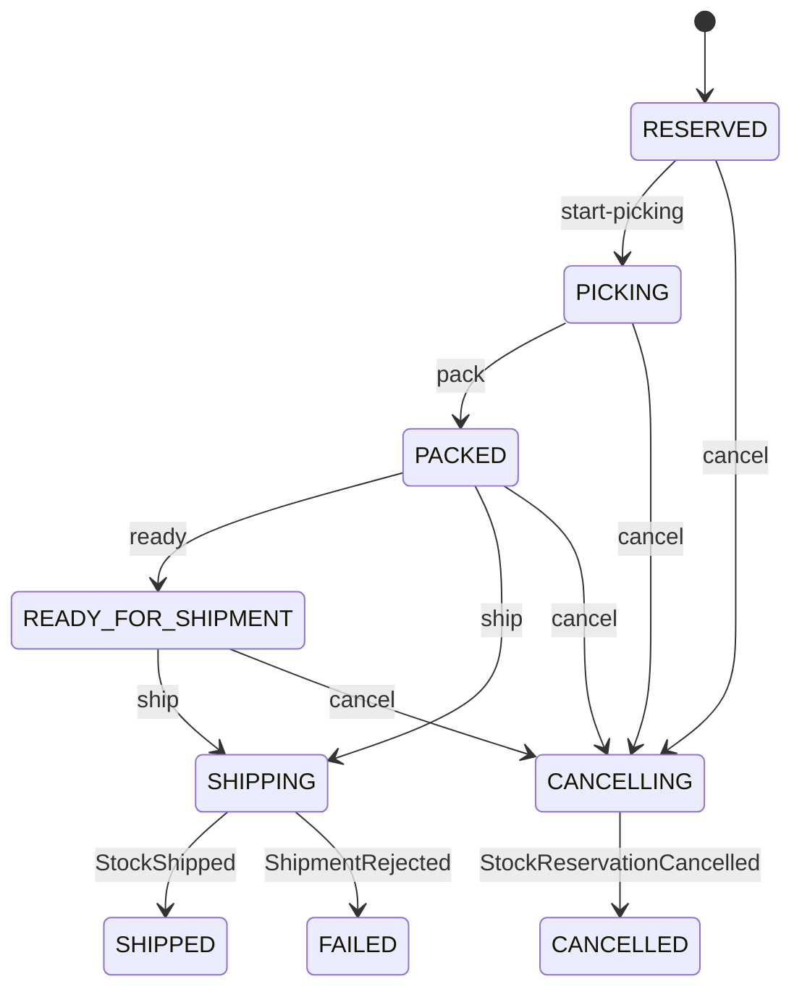

# Architecture and invariants

## Ownership

| Owner | Authoritative state | Reads from other services |
|---|---|---|
| Warehouse | Buildings, zones, racks, location limits/status; occupancy projection | Kafka capacity revisions |
| Product | SKU metadata, dimensions, weight and storage class | None |
| Inventory | Lots, physical quantity, reserved quantity, allocations, expiry, capacity ledger | Product and Warehouse REST |
| Placement | Placement jobs, attempts, decisions and scores | Warehouse REST |
| Reservation | Client-facing reservation lifecycle | Inventory result events |
| Shipment | Fulfilment state machine | Reservation REST; Inventory result events |
| Audit | Received event history | Kafka |

`available = quantity - reserved_quantity`. Database constraints require `quantity >= reserved_quantity >= 0`. A stock lot retains its immutable unit weight and volume; editing product metadata cannot rewrite existing stock physics. Deletion deactivates the SKU and prevents new receipts without erasing history.

## Transaction boundaries

Inventory obtains a PostgreSQL advisory transaction lock keyed by warehouse before mutating stock, allocations or capacity. This deliberately coarse lock serializes competing changes in one warehouse and works across multiple Inventory processes. Constraints provide a second line of defence. Locking is in PostgreSQL, so Redis lease expiry cannot allow overselling.

Receipts become unplaced stock. They count toward physical stock, but cannot be reserved until placed. Placement scores suitable storage locations and emits a decision. Inventory re-reads the destination's status/limits through Warehouse, then validates against its **own capacity ledger** in the same transaction as stock placement. An outdated Warehouse occupancy projection cannot overfill the ledger.

Moves split a lot when needed, preserving batch, expiry and unit dimensions. Only unreserved units can move or be written off. A move within one warehouse changes both locations atomically. Cross-warehouse transfer is outside this version's API.

Absolute adjustments require a reason. They cannot reduce quantity below reserved quantity. Increasing an unplaced lot is rejected: receive a new lot so it gets its own placement job.

## Reservations and FEFO

Reservation API writes `PENDING` plus `ReservationRequested`. Inventory allocates across placed, unexpired lots in expiry order, then creation time and ID. A savepoint rolls back *all* allocations if any line is short; the outer inbox transaction records a business rejection event. Duplicate product lines are rejected.

The Inventory expiry worker selects due reservations, takes the same warehouse lock as reserve/ship, and releases them. It uses durable database time/state rather than relying on Redis TTL notifications. If the worker was down, overdue records are processed after restart. Ship independently checks expiry, so delayed cleanup does not allow shipping an expired reservation.

## Shipment saga

The client creates a shipment from a confirmed reservation. A unique reservation ID in the Shipment database prevents two local shipments from claiming the same reservation. Inventory additionally records the shipment ID on completion and accepts only an active reservation.

`CREATED` is represented by the creation transaction/event rather than a separately persisted waiting state. The initial persisted state is `RESERVED`. A request to ship returns `SHIPPING`; actual stock deduction commits before `StockShipped`. Shipment then records `SHIPPED` and emits `ShipmentCompleted`. Replaying completion cannot deduct stock again.

An expiration/cancellation event can also cancel any not-yet-shipped shipment. If expiry races with a shipment, Inventory's warehouse transaction lock determines one valid outcome. Shipment lookup and reservation state are eventually consistent; authoritative validation happens again during shipment execution.

## Messaging

All services share `wms.events`, with separate consumer groups. Three partitions are created; messages use warehouse ID as their key where available. Java and Go partitioner implementations are not used as a correctness guarantee: transactions and revisions enforce consistency. Publishers run once per service instance in the default Compose topology. Scaling publishers requires explicit per-aggregate ordering/fencing work; do not assume global ordering.

The outbox publisher locks a batch, sends synchronously with acknowledgements, then marks it published. A send failure rolls back the batch. Inbox inserts use `(event_id, consumer)` uniqueness and commit with business effects. Offset commits follow database commits. Ignored event types also receive inbox markers to make replay deterministic.

Business rejection is a successful consumption that emits a rejection event. Unexpected processing failures are retried, then sent to `wms.events.DLT`. Publishing the DLT must succeed before committing the source offset. Recovery is explicit: fix the cause and replay the unchanged event ID. Unresolved saga commands in the DLT remain pending and visible until recovery.

## Placement retry

Placement jobs survive restarts. `NO_SUITABLE_LOCATION` remains pending and retries every ten seconds. An Inventory capacity/status rejection returns the job to pending. Redis holds a short token-owned per-warehouse mutex to reduce conflicting placement decisions; PostgreSQL row locks protect jobs, and Inventory capacity transactions are the correctness boundary.

A receipt is placed into one location; it is not automatically split across smaller locations. A job that cannot fit stays visible in `/placements`. If its assigned command reaches the DLT, replay it after repair rather than deleting the job.

## Known consistency window

An administrator may block a location concurrently with an Inventory transaction that already fetched its former status. This version rejects locations observed as blocked, but does not offer a distributed linearizable fencing protocol for that administrative race. Weight/volume capacity remains transactionally protected. Block operations should be performed after pausing warehouse mutations. See ADR-006.

## Code layout

Java services separate `api`, `application` and `domain`; shared persistence and messaging adapters live in `libs/java-common`. Go services separate domain rules and application use cases; reusable database, HTTP and Kafka adapters live in `libs/platform`. PostgreSQL queries are explicit within transactional use cases so lock scope and ordering remain visible. This is pragmatic layered architecture, not a claim of complete framework-free hexagonal isolation.
